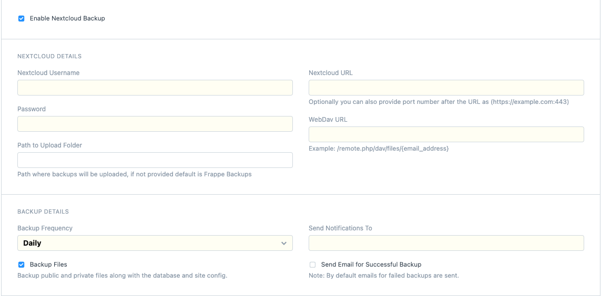

# NextCloud Integration

Custom Frappe App for NextCloud Backup

### NextCloud Settings Screen

<kbd></kbd>

* **Email**: Email address of your *NextCloud Account*
* **Password**: Your *NextCloud Account password* or *App Password* you might have created for this app.
* **NextCloud URL**: URL of site where NextCloud Account exist. *For eg("https://example.com")*.
Optionally you can also provide a port number after your URL as *("https://example.com:443")*
* **WebDav URL**: You will find this in your NextCloud Account. Example: */remote.php/dav/files/*{email_address}*/*
* **Path to Upload Folder**: You can provide the *path* of folder where you would like your files to be uploaded.
	* **NOTE**:
		1. The folder should have already been created.
		2. If not provided, a folder *Frappe Backups* will be created.
* **Backup Frequency**: One of either *Daily* or *Weekly* can be choosen.
* **Backup Files**: Check this option to *Backup public and private files along with the database*.
* **Send Notifications To**: Email on which the notification for Backups should be sent.
* **Send Email for Successful Backup**: Check this option to receive email for successful backups, by default emails for failed backups are sent.

### Development

#### How To Setup
You can download and install nextcloud-integration app using

```
bench get-app https://github.com/frappe/nextcloud-integration.git
bench --site {site_name} install-app nextcloud-integration
```

Use `bench start` command to run the project.

### License
This repository has been released under the [MIT License](LICENSE).
